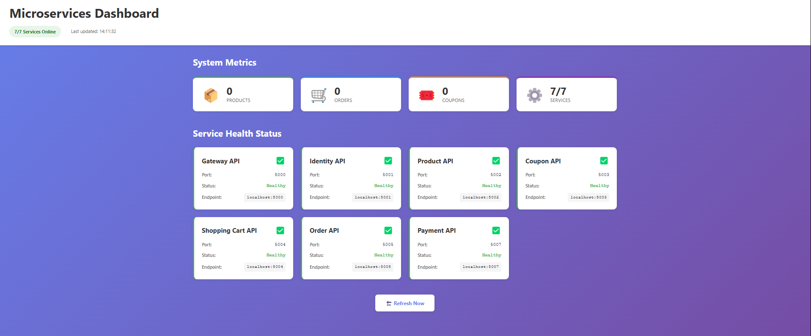
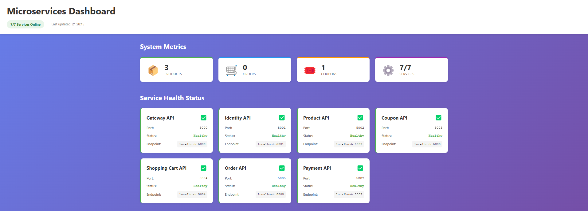

# Microservices E-Commerce Platform

A microservices-based platform built with ASP.NET Core 8.0, featuring a real-time monitoring dashboard, event-driven architecture with RabbitMQ, and API documentation via Swagger.

## Project Overview

This project demonstrates a microservices architecture implementing an e-commerce platform with the following capabilities:

- **User Authentication** - JWT-based authentication using Duende IdentityServer
- **Product Catalog** - Product management with categories and inventory tracking
- **Shopping Cart** - User cart management with product validation
- **Coupon System** - Discount coupons with validation and usage limits
- **Order Processing** - Order creation with coupon application and status tracking
- **Payment Processing** - Payment handling with event-driven notifications
- **Event-Driven Communication** - Asynchronous messaging via RabbitMQ and MassTransit

## Technology Stack

- **Backend**: ASP.NET Core 8.0, Entity Framework Core
- **Database**: PostgreSQL 16
- **Message Broker**: RabbitMQ with MassTransit
- **API Gateway**: Ocelot
- **Authentication**: Duende IdentityServer, JWT
- **Frontend**: React 18, Vite, TailwindCSS
- **Containerization**: Docker, Docker Compose
  
## Quick Start

### Prerequisites
- Docker Desktop (running)
- Node.js (v18+)

### Launch Everything

**Windows (PowerShell):**
```powershell
.\launch.ps1
```

**Linux/Mac:**
```bash
chmod +x launch.sh
./launch.sh
```

The script will start all microservices and open the dashboard at: **http://localhost:55585**

## Architecture

### Microservices

| Service | Port | Description | Swagger UI |
|---------|------|-------------|------------|
| **Gateway.API** | 5000 | API Gateway (Ocelot) - routes requests | http://localhost:5000/swagger |
| **Identity.API** | 5001 | Authentication & authorization | http://localhost:5001/swagger |
| **Product.API** | 5002 | Product catalog management | http://localhost:5002/swagger |
| **Coupon.API** | 5003 | Discount coupons management | http://localhost:5003/swagger |
| **ShoppingCart.API** | 5004 | Shopping cart operations | http://localhost:5004/swagger |
| **Order.API** | 5005 | Order processing | http://localhost:5005/swagger |
| **Payment.API** | 5007 | Payment processing | http://localhost:5007/swagger |

## Testing the APIs

### Using Swagger UI (Recommended)
Each service has Swagger documentation. Open any service's Swagger URL from the table above.

See **[USAGE_GUIDE.md](USAGE_GUIDE.md)** for complete API documentation and examples.

## Project Structure

```
Microservices/
├── src/
│   ├── Common/
│   │   └── EventBus/              # Shared event bus (MassTransit + RabbitMQ)
│   ├── Gateway/
│   │   └── Gateway.API/           # Ocelot API Gateway
│   ├── Identity/
│   │   └── Identity.API/          # IdentityServer authentication
│   └── Microservices/
│       ├── Product.API/           # Product catalog
│       ├── Coupon.API/            # Coupon management
│       ├── ShoppingCart.API/      # Shopping cart
│       ├── Order.API/             # Order processing
│       └── Payment.API/           # Payment processing
├── client-app/                    # React dashboard (Vite)
├── docker-compose.yml             # Container orchestration
├── launch.ps1                     # Windows launch script
├── launch.sh                      # Linux/Mac launch script
└── USAGE_GUIDE.md                 # Detailed API documentation
```

## Application operation




## Documentation

- **[USAGE_GUIDE.md](USAGE_GUIDE.md)** - Complete API documentation with examples
- **Swagger UI** - Available at each service's `/swagger` endpoint

## Service Endpoints Summary

| Endpoint | URL |
|----------|-----|
| Dashboard | http://localhost:55585 |
| Gateway API | http://localhost:5000 |
| Identity API | http://localhost:5001 |
| Product API | http://localhost:5002 |
| Coupon API | http://localhost:5003 |
| Shopping Cart API | http://localhost:5004 |
| Order API | http://localhost:5005 |
| Payment API | http://localhost:5007 |
| RabbitMQ Management | http://localhost:15672 |
