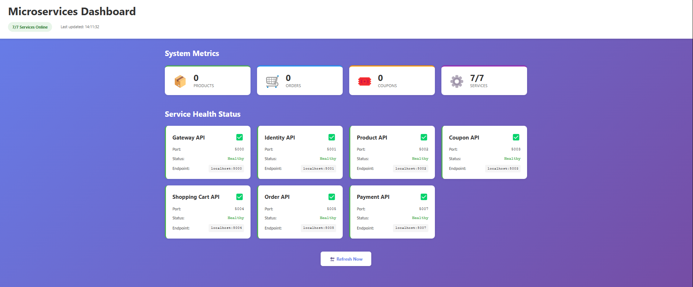
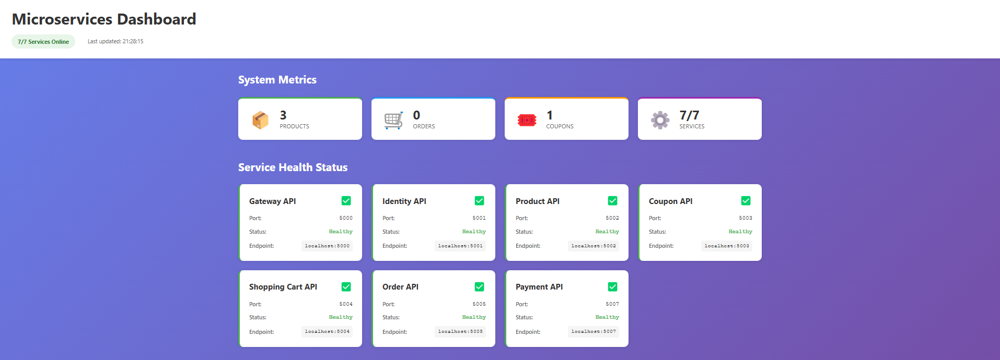

# Microservices E-Commerce Platform

A microservices-based platform built with ASP.NET Core 8.0, featuring a real-time monitoring dashboard, event-driven architecture with RabbitMQ, saga orchestration, and API documentation via Swagger.

## Project Overview

This project demonstrates a microservices architecture implementing an e-commerce platform with the following capabilities:

- **User Authentication** - JWT-based authentication using Duende IdentityServer
- **Product Catalog** - Product management with categories and inventory tracking
- **Shopping Cart** - User cart management with product validation
- **Coupon System** - Discount coupons with validation, usage limits, and saga-safe release
- **Order Placement (Saga)** - Distributed order flow orchestrated by a MassTransit saga state machine: stock reservation → coupon validation (parallel) → order creation; compensating releases on any failure
- **Payment Processing** - Payment handling with event-driven notifications
- **API Versioning** - URL-based versioning (`/api/v{version}/`) across all services via Asp.Versioning.Mvc
- **Transactional Outbox** - MassTransit EF Core outbox in Order.API and Orchestrator.API ensures at-least-once delivery without dual-write risk
- **Input Validation** - FluentValidation auto-validation on all write endpoints
- **Event-Driven Communication** - Asynchronous messaging via RabbitMQ and MassTransit

## Technology Stack

- **Backend**: ASP.NET Core 8.0, Entity Framework Core
- **Database**: PostgreSQL
- **Message Broker**: RabbitMQ with MassTransit
- **Saga Orchestration**: MassTransit `MassTransitStateMachine` with EF Core repository and optimistic concurrency (`ISagaVersion`)
- **API Gateway**: Ocelot
- **Authentication**: Duende IdentityServer, JWT
- **Validation**: FluentValidation with auto-validation
- **Frontend**: React 18, Vite
- **Containerization**: Docker, Docker Compose
- **Testing**: MSTest, Moq

## Quick Start

### Prerequisites
- Docker Desktop (running)
- Node.js (v18+)

### Launch Everything

**Windows (PowerShell):**
```powershell
.\launch.ps1
```

**Linux/Mac:**
```bash
chmod +x launch.sh
./launch.sh
```

The script will start all microservices and open the dashboard at: **http://localhost:55585**

## Architecture

### Microservices

| Service | Port | Description | Swagger UI |
|---------|------|-------------|------------|
| **Gateway.API** | 5000 | API Gateway (Ocelot) — routes all requests, exposes saga status endpoint | http://localhost:5000/swagger |
| **Identity.API** | 5001 | Authentication & authorization (Duende IdentityServer) | http://localhost:5001/swagger |
| **Product.API** | 5002 | Product catalog | http://localhost:5002/swagger |
| **Coupon.API** | 5003 | Discount coupons | http://localhost:5003/swagger |
| **ShoppingCart.API** | 5004 | Shopping cart operations | http://localhost:5004/swagger |
| **Order.API** | 5005 | Starts saga, fulfills orders, manages order status | http://localhost:5005/swagger |
| **Orchestrator.API** | 5006 | Saga state machine + status polling endpoint | http://localhost:5006/swagger |
| **Payment.API** | 5007 | Payment processing | http://localhost:5007/swagger |

### Order Placement Flow (Saga)

```
Client → POST /api/v1/orders
                │
                │ returns 202 Accepted { correlationId }
                │
                ▼
         Order.API publishes OrderPlacedCommand
                │
                │
         Orchestrator.API (saga)
            ┌───┴───────────────────────┐
            │                           │
       ReserveStockCommand        ValidateCouponCommand
       → Product.API              → Coupon.API (only if coupon present)
            │                           │
       StockReservedEvent         CouponValidatedEvent
            └───────────┬───────────────┘
                        │
                        │ (both flags true)
                        │
                  FulfillOrderCommand
                  → Order.API (DB transaction + outbox)
                        │
                        │
                  OrderFulfilledEvent  →  saga Completed
                  OrderCreatedEvent    →  Payment.API (Pending record)
```

On any failure the saga publishes compensating `ReleaseStockCommand` and/or `ReleaseCouponCommand`.

## Unit Tests

The project includes unit tests across 5 test projects covering controllers, services, models, gateway configuration, and saga state machine behaviour.

| Project | Covers |
|---------|--------|
| `Product.API.Tests` | Controller, service, model |
| `Order.API.Tests` | Controller (incl. 202 saga start), service |
| `ShoppingCart.API.Tests` | Cart controller and service |
| `Gateway.Tests` | Ocelot route configuration |
| `Orchestrator.Tests` | Saga state machine |

## Testing the APIs

### Using Swagger UI (Recommended)
Each service has Swagger documentation. Open any service's Swagger URL from the table above.

See **[USAGE_GUIDE.md](USAGE_GUIDE.md)** for complete API documentation and examples.

## Project Structure

```
Microservices/
├── src/
│   ├── Common/
│   │   └── EventBus/              # Shared contracts (OrderSagaMessages) + AddEventBus extension
│   ├── Gateway/
│   │   └── Gateway.API/           # Ocelot API Gateway + health endpoints
│   ├── Identity/
│   │   └── Identity.API/          # Duende IdentityServer authentication
│   └── Microservices/
│       ├── Product.API/           # Product catalog; ReserveStock/ReleaseStock consumers
│       ├── Coupon.API/            # Coupon management; ValidateCoupon/ReleaseCoupon consumers
│       ├── ShoppingCart.API/      # Shopping cart (cleared after order fulfilment)
│       ├── Order.API/             # StartOrderSagaAsync + FulfillOrderConsumer (outbox)
│       ├── Orchestrator.API/      # Saga state machine + SagaController (status polling)
│       └── Payment.API/           # Payment processing; OrderCreatedEventHandler
├── tests/
├── client-app/                    # React 18/Vite dashboard — health + metrics polling every 10 s
├── docker-compose.yml             # All services + OrchestratorDb + RabbitMQ
├── MicroservicesECommerce.sln     # Solution file (all projects registered)
├── launch.ps1                     # Windows launch script
├── launch.sh                      # Linux/Mac launch script
└── USAGE_GUIDE.md                 # Detailed API documentation
```

## Application operation




## Documentation

- **[USAGE_GUIDE.md](USAGE_GUIDE.md)** - Complete API documentation with examples
- **Swagger UI** - Available at each service's `/swagger` endpoint
